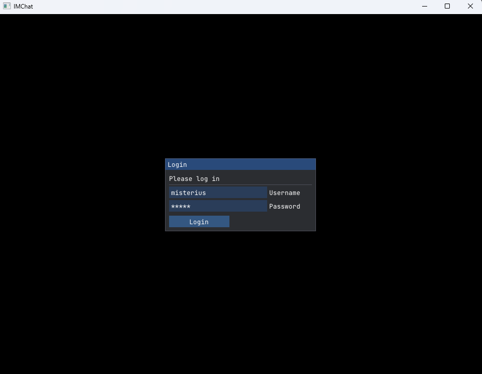
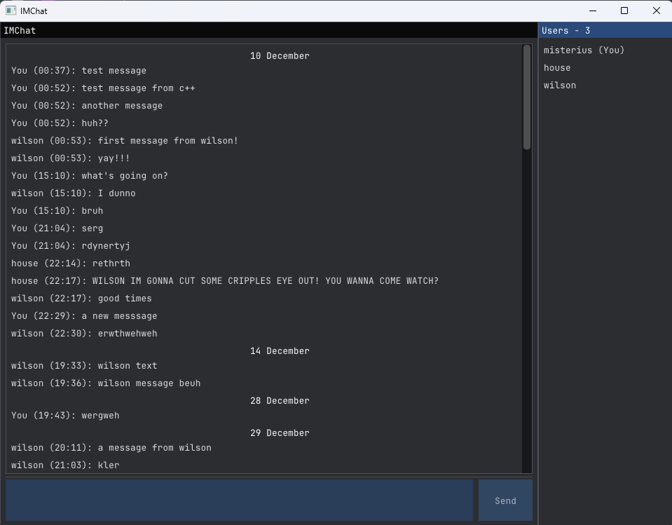

# IMChat
A small instant messaging app I built in C++ to learn about networking,
boost::asio and databases.

It’s a client-server setup with a custom json-based protocol, 
a small GUI and PostgreSQL database.

## Features
- Real-time messaging between multiple clients
- Login system with username + password (hashed on client)
- Chat history is stored and loaded from the database
- Shows currently connected users
- Messages are timestamped and synced from the server
- Basic UI with scrolling chat and input box

## UI showcase

## Tech used
- Modern C++ (std=c++20)
- boost::asio for asynchronous networking
- Dear ImGui for simple UI (with utf8 input support)
- libpqxx for PostgreSQL database connection in C++
- nlohmann::json for message serialization, fmt for formatted logging

## Quick architecture overview
- The server accepts TCP connections and keeps track of clients
- Messages are sent as structured JSON with a small header
- When a user logs in:
  - Server checks credentials in PostgreSQL
  - Sends back chat history + active users
- When someone sends a message:
  - It gets saved to the database
  - Then broadcast to all other connected clients

## Building and running the project
